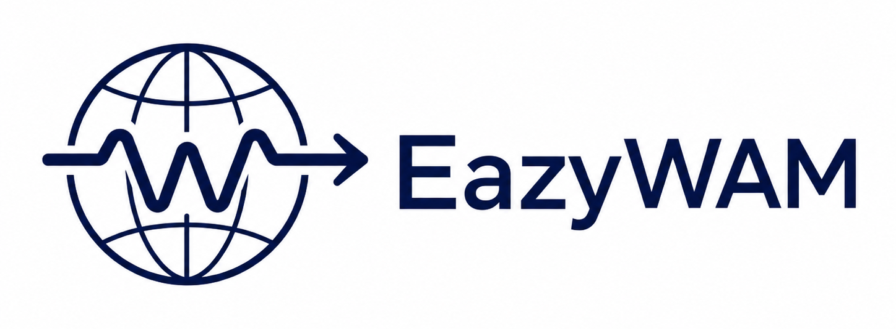

<p align="center">
  
</p>

<p align="center">
  <a href="README.md">English</a> |
  <a href="LICENSE.md"></a>
  <a href="pyproject.toml"></a>
</p>

# EazyWAM

EazyWAM 是一个面向 world-action model 的部署与推理加速框架。它把分散在不同
仓库里的 checkpoint、运行环境、资产准备、评测脚本、服务入口、优化开关和
trace，整理成一个以 model id 为中心的 `wam` 工作流。

## 快速上手

先 clone 仓库：

```bash
git clone https://github.com/eazywam/eazywam.git
cd eazywam
```

### 创建 Python 环境

使用 `uv` 创建一个干净的 Python 3.10+ 环境，并安装当前源码。它会安装
`pyproject.toml` 里声明的 core package 依赖；core CLI 不需要额外执行
`requirements.txt`。

方案 A：手动安装

```bash
uv venv --python 3.10
source .venv/bin/activate
uv pip install -e .
```

方案 B：使用 setup 脚本

```bash
scripts/setup_core_env.sh
source .venv/bin/activate
```

真实 WAM runtime、checkpoint、simulator 和 GPU 依赖会通过对应模型的
`doctor` 和 `prepare` 路径处理。

如果你更习惯 Conda，也可以先创建并激活 Python 3.10+ Conda 环境，然后用
`python -m pip install -e .` 安装当前源码。

### 查看模型

```bash
wam list
wam info fastwam-libero
```

### 验证本地 harness

```bash
wam run fake-open-loop
wam run fake-open-loop --opt fake_cache
```

### 验证本地 policy server

```bash
wam serve fake-open-loop --smoke
```

### 准备 FastWAM 资产

```bash
wam doctor fastwam-libero --cache-dir /path/to/wam-cache
wam prepare fastwam-libero --cache-dir /path/to/wam-cache --download --asset eval
```

### 用一条 observation 跑 FastWAM

```bash
wam run fastwam-libero \
  --input examples/fastwam_libero/obs.json \
  --output /tmp/fastwam-action.json \
  --cache-dir /path/to/wam-cache
```

### 在 LIBERO 里评测 FastWAM

需要在已经准备好的 FastWAM runtime 里运行。

```bash
wam eval fastwam-libero \
  --workload libero-single-task \
  --task-id 0 \
  --num-trials 1 \
  --cache-dir /path/to/wam-cache
```

### 查看 trace

```bash
ls runs/*/trace.jsonl
```

## 模型库

模型库只列 curated real WAM entries。内置 smoke-test backend 只用于本地检查
harness contract，不作为模型库 entry 展示。

| Model id | 上游资源 | 起步命令 | 当前状态 |
| --- | --- | --- | --- |
| `fastwam-libero` | [](https://github.com/yuantianyuan01/FastWAM) [](https://huggingface.co/yuanty/fastwam) | `wam prepare fastwam-libero --download --asset eval` | 第一个真实模型集成目标。SuperPod H800 上 single-task native eval、serve smoke、reference full-suite eval 和 native full-suite sweep 都已跑通；native sweep 是 9/10，对齐后的 task6 证据是 native 和 reference 都为 4/5。 |
| `cosmos-policy-libero` | [](https://github.com/NVlabs/cosmos-policy) [](https://huggingface.co/nvidia/Cosmos-Policy-LIBERO-Predict2-2B) | `wam info cosmos-policy-libero` | native smoke 和官方脚本 parity 集成已开始。 |
| `dreamzero-droid-sim` | [](https://github.com/dreamzero0/dreamzero) [](https://huggingface.co/GEAR-Dreams/DreamZero-DROID) [](https://huggingface.co/owhan/DROID-sim-environments) | `wam info dreamzero-droid-sim` | resident policy-server 路径已开始；DROID sim 需要更重的多 GPU runtime。 |

## 常用命令

```bash
wam --help
wam <command> --help
wam list
wam info <model-id>
wam doctor <model-id>
wam prepare <model-id>
wam run <model-id> --input obs.json --output action.json
wam eval <model-id> --workload <workload>
wam serve <model-id>
wam compare <trace-a> <trace-b>
```

## 开发

core package 开发使用 `uv` 来保持本地检查可复现：

```bash
uv sync --dev
uv run pytest
uv run ruff check .
```

## 文档

- `docs/cli_entrypoints.md` - 命令行为。
- `docs/fastwam_libero_eval_setup.md` - FastWAM 环境和 eval 流程。
- `docs/dependency_isolation.md` - 容器和自管理环境。
- `docs/wamfile.md` - model entry schema。
- `docs/optimization_integration.md` - optimization profile 设计。
- `docs/trace_schema.md` - trace 事件 schema。
- `docs/roadmap.md` - 当前里程碑。

## License

EazyWAM 使用 [MIT License](LICENSE.md)。Vendored 第三方代码和外部模型资产仍遵循
各自上游许可证。
